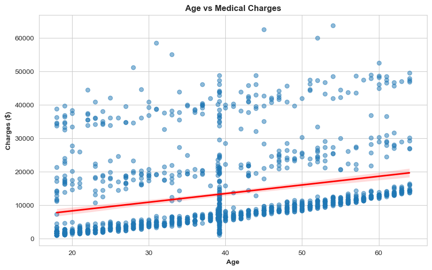
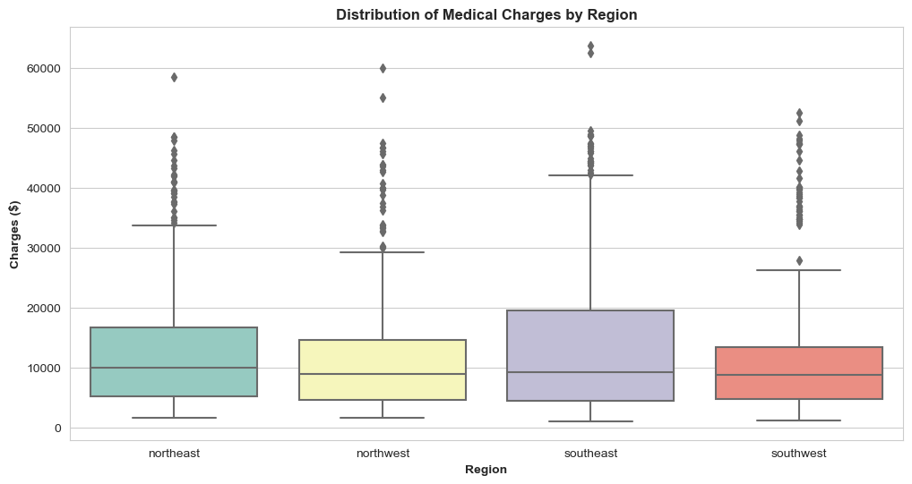
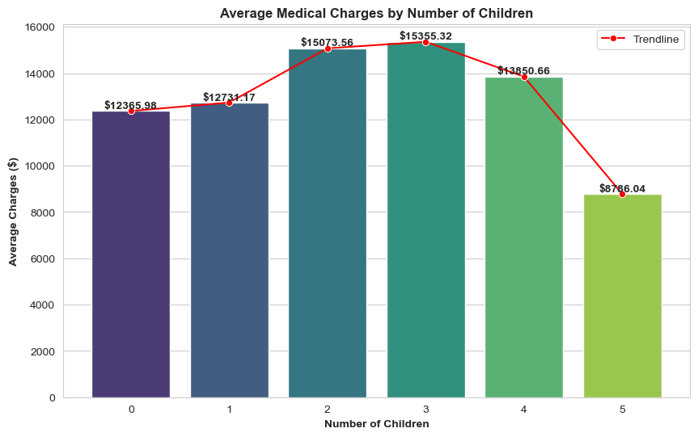

# 💊🩺 Medical Cost Analysis: Data Preprocessing and Decision Tree Classification

This study analyses a medical insurance dataset using **Python** to uncover factors that influence medical charges and predict smoking status. It demonstrates data preprocessing, exploratory data analysis with visualisations, and decision tree classification using Scikit-learn.

---

## 🏷️ Business Context

Understanding what drives individual medical costs is valuable for insurers, healthcare providers, and policymakers. This study explores how demographic and lifestyle factors such as age, region, BMI, and smoking status relate to insurance charges, and builds a decision tree classifier to predict smoking status from patient data.

---

## 🗂️ Dataset

A medical insurance dataset containing patient demographic and cost information across 8 variables.

- **Raw Records**: 1,340
- **Cleaned Records**: 1,199 (after handling missing values, duplicates, inconsistent labels, and outliers)
- **Variables**: PersonID, age, sex, BMI, children, smoker, region, charges

---

## 📋 Executive Summary

- **Age and Charges**: Positive correlation observed; older individuals tend to incur higher medical costs
- **Regional Variation**: Southwest has the lowest median charges; Northeast the highest
- **Dependents**: No clear trend between number of children and average medical charges; other factors likely play a larger role
- **Smoking Prediction**: Decision tree classifier achieved 96% overall accuracy, with 98% precision for non-smokers and 89% precision for smokers

> **Business Takeaway**: Age and region are meaningful indicators of medical cost. Smoking status can be predicted with high accuracy using demographic and cost features, making it a viable input for risk stratification.

---

## ⚙️ Tools Used

- **Language**: Python
- **Libraries**: Pandas, NumPy, Matplotlib, Scikit-learn

---

## 🗃️ Project Structure

- `data/` — Raw and cleaned dataset (.csv)
- `notebook/` — Jupyter notebook with full code and analysis (.ipynb)
- `visuals/` — Screenshots of charts and decision tree

---

## 🔍 Analytics Approach

**Data Preprocessing**
- Imputed 123 missing values in the `age` column with the column mean (no outliers detected in age)
- Removed 2 duplicate rows for PersonID 100, leaving 1,338 unique records
- Standardised inconsistent labels in the `sex` column ('F' to 'female', 'M' to 'male')
- Converted `sex`, `smoker`, and `region` from object to category type
- Removed outliers in the `charges` column using boxplot detection, leaving 1,199 records

**Decision Tree Classification**
- Target Variable: `smoker` (binary)
- Excluded `PersonID` as it is a unique identifier with no predictive value
- Encoded categorical features and split data into training and test sets
- Trained a decision tree classifier with max depth constraint to prevent overfitting
- Tree splits on Gini impurity to identify the most informative features at each node

---

## 📈 Visualisations

### Scatterplot: Age vs Medical Charges

> Positive correlation between age and charges. Older individuals consistently incur higher medical costs, likely due to increased prevalence of age-related health conditions.

### Box Plot: Medical Charges by Region

> Southwest has the lowest median charges; Northeast the highest. Regional variation may reflect differences in healthcare pricing, service availability, and lifestyle-related health trends.

### Bar Chart: Average Charges by Number of Children

> 3 dependents are associated with the highest average charges ($15,355.32); 5 dependents the lowest ($8,786.04). No clear trend, suggesting dependents alone are not a reliable predictor of charges.

---

## 🎯 Key Results

| Metric | Value |
|---|---|
| Overall accuracy | 96% |
| Precision (non-smokers) | 0.98 |
| Recall (non-smokers) | 0.97 |
| Precision (smokers) | 0.89 |
| Recall (smokers) | 0.91 |

---

## 🚫 Limitations

- Outlier removal reduced the dataset by ~10%, which may affect the representativeness of high-charge cases
- Decision tree results may vary with different random seeds or train/test splits
- Dataset does not include variables like pre-existing conditions or insurance plan type, which likely influence charges significantly
